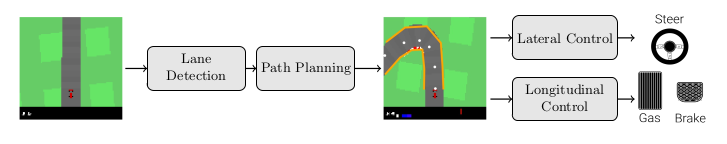
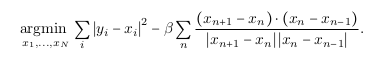
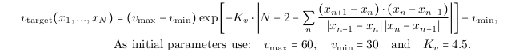
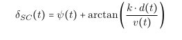
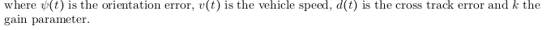
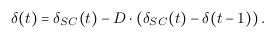
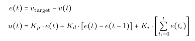
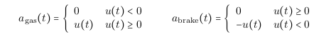

# Modular-Pipeline-Car
The following is a Modular Pipeline based implementation of a CarRacing agent simulated on the Gym environment.  
The pipeline contains a lane Detection module, a path planning module and control unit. 

  

The first module of the pipeline aims to detect the lane boundaries by finding edges in the state image, assigning the edges to a lane boundary and fitting splines to the point set of the lane boundaries.The code for this is in the lane_detection.py file. 

1) Edge Detection: We convert our observation space to grayscale. We then isolate the road through gradient based edge detection.
2) Assign Edges to Lane Boundaries: Given a set of edges (maxima) and assuming that these edges are on the lane boundaries, we would like to assign each maximum to one of the two lane boundaries. Our approach consists of finding the maxima in the image row closest to the car. By searching for the nearest neighbor edges along each boundary, we can assign the edges to the lane boundaries.
3) Spline Fitting: For fitting the lane boundaries, we use parametric spline.

The second module of the pipeline is to plan the path of the car. We do this by identifying the road centers and waypoints folllowed by smoothing. The code for this can be found in waypoint_prediction.py

1) Road Center: A simple path for the car would be to follow the road center. We use the lane boundary splines and derive lane boundary points for 6 equidistant
spline parameter values.
2) Path Smoothing: Since we are creating a racing car, we need to tune the waypoints to the road’s course, e.g. hitting the apex. We do this by minimizing the following equation.

  

There, x i are the waypoints that are varied in order to minimize the objective, y i are the center
waypoints estimated in task.
3) Target Speed Prediction: In addition to the spatial path, we need to know how fast the car should drive on the path. Heuristically, the car should accelerate to a maximum velocity if the path is smooth and decelerate before corners. 

  

The thrid module of the pipeline is to build a controller for steering the vehicle on the predicted path. The code for this can be found in lateral_control.py

1) Stanley Controller: We use the Stanley control theory to determine the angle of curvature using the following equation.

  
  

2) Damping: We now improve the steering angle control by damping the difference between the steering command and the steering wheel angle of the previous step.

  

In the fourth module we set up a control law for gas and braking.
1) PID Controller:For implementing the PID controller, we must use a discretized version of the control law

  

If the control signal u(t) is larger than 0, we choose the gas value equal to the control signal. If u
is smaller than 0, we choose the brake value equal to the negative control signal:

  

To install the gym environment, 
1) extract sdc_gym.zip 
2) cd sdc_gym 
3) pip install -e ."[box2d]" 

To run the agent, 
1) python modular_pipeline.py score

